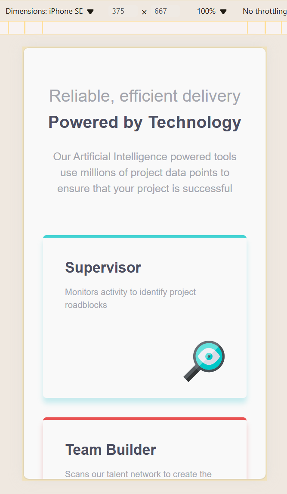
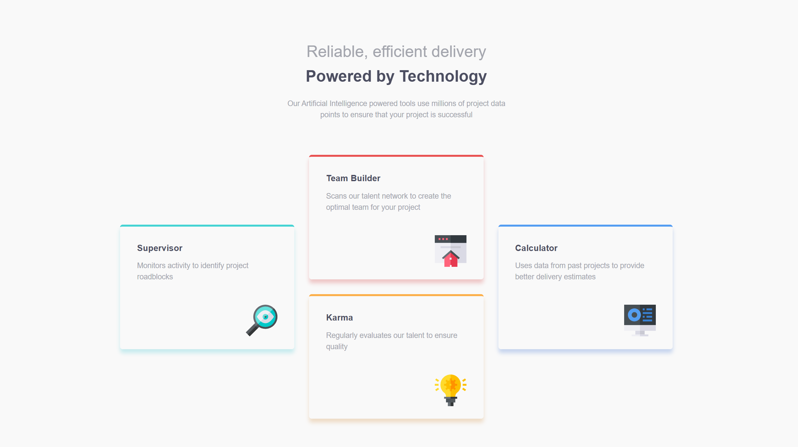

# four-card-feature-section
Page with 4 adaptive function cards (HTML, CSS, JS)

# Frontend Mentor - Four card feature section solution

This is a solution to the [Four card feature section challenge on Frontend Mentor](https://www.frontendmentor.io/challenges/four-card-feature-section-weK1eFYK). 

## Table of contents

- [Overview](#overview)
  - [The challenge](#the-challenge)
  - [Screenshot](#screenshot)
  - [Links](#links)
- [My process](#my-process)
  - [Built with](#built-with)
  - [What I learned](#what-i-learned)
  - [Continued development](#continued-development)
- [Author](#author)

## Overview

### The challenge

Users should be able to:

- View the optimal layout for the site depending on their device's screen size
- Open each card in separate modal window.

### Screenshot

### Links

- Solution URL: [Add solution URL here](https://your-solution-url.com)
- Live Site URL: [Add live site URL here](https://your-live-site-url.com)

## My process

### Built with

- Semantic HTML5 markup
- CSS custom properties
- Flexbox
- CSS Grid
- Java script

### What I learned

USo, I’ve been messing around with JavaScript lately, and honestly, it's like giving my site a shot of espresso—it’s all animated and interactive now! No more boring static pages, everything’s moving and grooving, making the whole thing look way more legit.

On top of that, I finally started getting cozy with CSS Grid. I used to be all about Flexbox like it was my safety blanket, but now Grid and I? We’re pretty tight. Less “wait, what?” moments and more “I got this.”

Oh, and I learned how to throw in modal windows like a pro. Seriously, it’s a game-changer—especially for mobile users. Pop-ups have never been so satisfying.

### Continued development

Moving forward, I'm planning to dive deeper into JavaScript and really level up those interactive elements—who doesn’t love a good hover effect or smooth transition, right? I'm also on a mission to make Grid my BFF (sorry Flexbox, you’re still cool, though). The goal is to get super comfortable with both so I can whip up layouts like a pro without a second guess.

Also, I want to explore more advanced stuff, like making custom modals and perfecting responsive designs. Gotta make sure everything looks 🔥 on mobile too. Oh, and maybe start playing around with some animations to give the site that extra “wow” factor.

Oh, and mark my words: my next project will be written with SASS for sure. No more excuses—just cleaner, faster CSS like a boss! 😎

## Author
- Frontend Mentor - [@Grimm-N](https://www.frontendmentor.io/profile/Grimm-N)
- Twitter - [@Grimm__N](https://x.com/Grimm__N)
